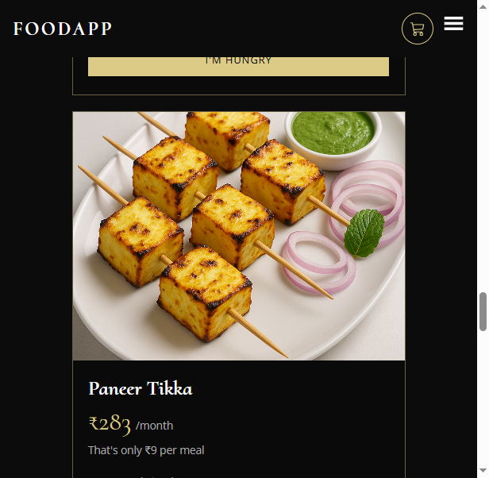
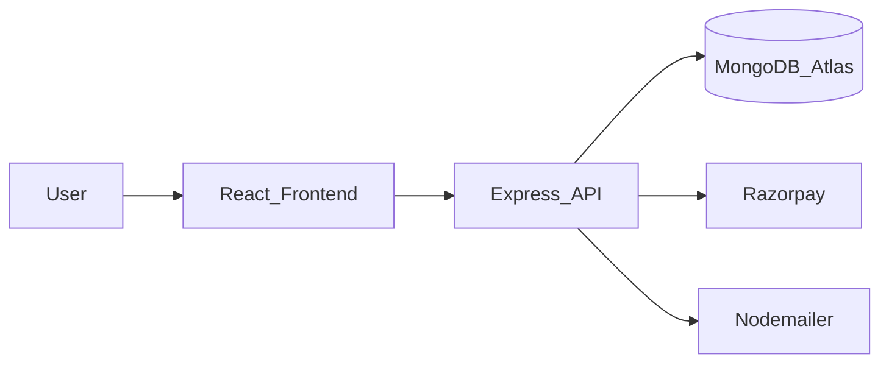

# FoodApp Backend

[](https://github.com/Jayesh049/FoodApp_Backend/actions/workflows/ci.yml)
[](LICENSE)

API for vegetarian meal plans, with server-priced checkout. [Live app](https://foodapp-frontend-z1zg.onrender.com) · [API health](https://foodapp-backend-joksepha.onrender.com/health) · [Built vs template](docs/BUILT_VS_TEMPLATE.md)


`POST /api/v1/booking/` drops any client total and recomputes from the stored plan. Confirm checks the Razorpay signature and the booking owner, and the same payment id is a no-op the second time. The JWT stays in an httpOnly cookie.



| | |
|---|---|
| **Frontend (UI)** | [FoodApp_Frontend](https://github.com/Jayesh049/FoodApp_Frontend) |
| **This repo (API)** | [FoodApp_Backend](https://github.com/Jayesh049/FoodApp_Backend) |
| **Architecture (developers)** | [docs/ARCHITECTURE.md](docs/ARCHITECTURE.md) |
| **OpenAPI** | Local: [http://localhost:3000/api/docs](http://localhost:3000/api/docs) · JSON: `/api/docs.json` |

---

## How it works (plain English)

Think of this server as the **kitchen office** behind the website:

1. A person opens the React app and taps **Buy** on a meal plan.
2. The app asks this API: “Is this user logged in? What plans exist? Create a booking.”
3. The API checks identity (JWT in an HTTP-only cookie), talks to **MongoDB**, and creates an order.
4. **Razorpay** handles the payment; the API confirms ownership before marking the booking paid.
5. **Email** (Nodemailer) can send verification and password-reset messages.



You do **not** need to be an engineer to skim this README. Developers should open [docs/ARCHITECTURE.md](docs/ARCHITECTURE.md) for routes, folders, and flows.

---

## Engineering decisions

- **Server-side pricing** — amounts come from the stored plan; the client cannot set the charged total.
- **httpOnly cookie + CSRF** — JWT is not in `localStorage`; mutating requests need the CSRF header; logout bumps `tokenVersion`.
- **Webhook + reconcile** — raw-body Razorpay webhook signature check; admin reconcile for abandoned pending orders.
- **Idempotent confirm** — duplicate payment id is a no-op; booking create accepts `Idempotency-Key`.
- **RAG fallback** — name search when Ollama or the vector index is down.

Optional Stripe Checkout sits beside Razorpay when `STRIPE_SECRET_KEY` and `STRIPE_WEBHOOK_SECRET` are set (env only).

Scope note: [docs/BUILT_VS_TEMPLATE.md](docs/BUILT_VS_TEMPLATE.md). GitHub sidebar fields: [docs/GITHUB_PRESENTATION.md](docs/GITHUB_PRESENTATION.md).

- **Auth** — signup, login, email verify, forgot/reset password (JWT cookies)
- **Users** — profile; admin-gated user listing
- **Plans** — CRUD-style meal plans + media helpers
- **Bookings** — create/list/manage bookings tied to the logged-in user
- **Payments** — Razorpay order + verify path
- **Reviews, contact, delivery/location** — supporting product features
- **Suggest (optional RAG)** — semantic suggestions when Ollama/Atlas vector search is configured
- **Hardening basics** — Helmet, CORS allowlist, rate limits, body size caps, structured logging (pino)

---

## Stack

| Layer | Choice |
|-------|--------|
| Runtime | Node.js |
| Framework | Express (MVC-style: routes → controllers → models) |
| Database | MongoDB + Mongoose (Atlas-ready) |
| Auth | JWT + `cookie-parser` |
| Payments | Razorpay |
| Email | Nodemailer |
| Uploads | Multer |
| Tests | Node built-in test runner (`npm test`) |

---

## Quick start (local)

```powershell
cd Backend
copy .env.example .env
# Fill DB_LINK, JWTSECRET, FRONTEND_URL, Razorpay, email, etc. (names only in .env.example)
npm install
npm start
```

Default API port: **3000** (override with `PORT` in `.env`).

Health-style entry: routes mount under `/api/v1/...` (see architecture doc).

```powershell
npm test
```

---

## Environment (names only)

Copy [`.env.example`](.env.example) → `.env`. **Never commit `.env` or `secrets.js`.**

| Variable | Purpose |
|----------|---------|
| `DB_LINK` | MongoDB connection string |
| `JWTSECRET` | JWT signing secret |
| `FRONTEND_URL` | CORS + email links (e.g. `http://localhost:3001`) |
| `ADMIN_EMAIL` / `ADMIN_PASSWORD` | Admin seed credentials |
| `APP_EMAIL` / `APP_PASSWORD` | Mail transport |
| `KEY_ID` / `KEY_SECRET` | Razorpay |
| `HF_TOKEN`, `OLLAMA_*`, … | Optional image/RAG tooling |

---

## Security posture (honest)

This project is built as a **portfolio-grade full-stack API** with real auth, payments, and hardening work in progress (Helmet, CORS, rate limits, ObjectId validation, ownership checks on bookings).

It is **not** a claim that one repo alone guarantees a $200k secure-remote offer — those roles also need interview depth, production ops, and broader experience. Use this repo to show how you design APIs and think about security.

---

## Sibling frontend

UI lives here: **[Jayesh049/FoodApp_Frontend](https://github.com/Jayesh049/FoodApp_Frontend)**  
Point `FRONTEND_URL` at that app’s origin when running locally or in production.

---

## License

[MIT](LICENSE).
