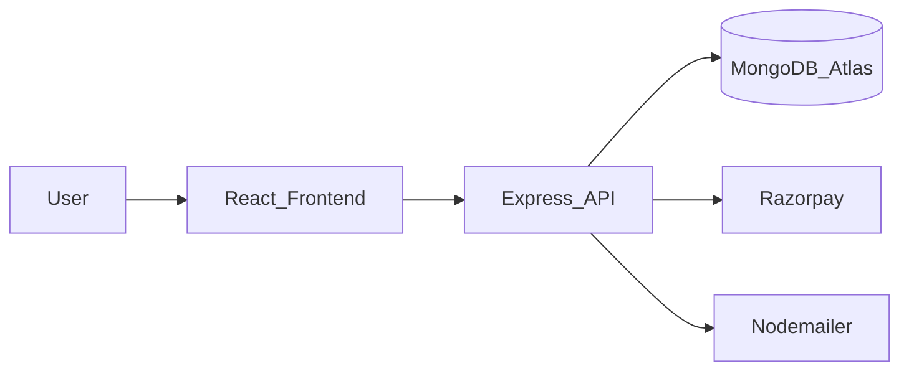
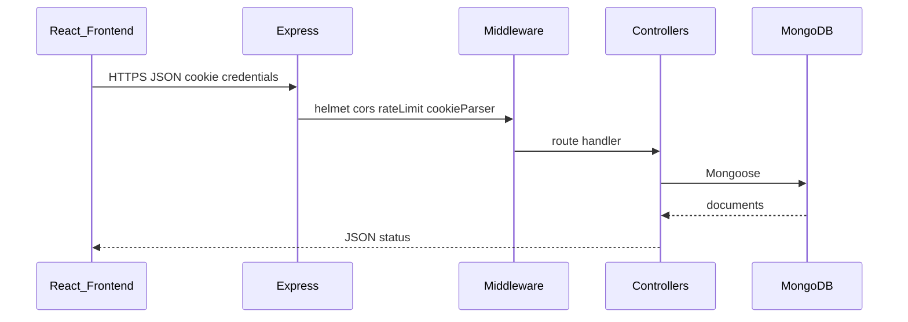
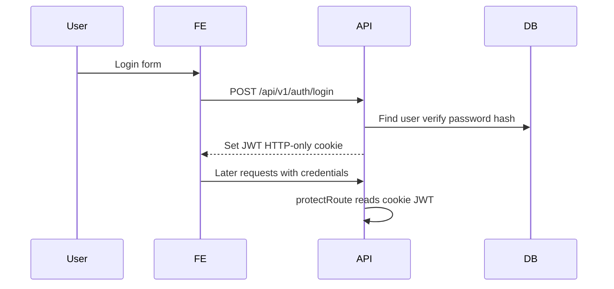

# FoodApp Backend — Architecture

For a non-technical overview, see the root [README.md](../README.md).  
Frontend: [FoodApp_Frontend](https://github.com/Jayesh049/FoodApp_Frontend).

## System context



## Folder map (MVC-style)

| Path | Role |
|------|------|
| `api.js` | App bootstrap: middleware, routers, listen |
| `app.js` | Alternate/legacy entry (prefer `api.js` via `npm start`) |
| `routes/` | Express routers (`/api/v1/...`) |
| `controller/` | Request handlers / business orchestration |
| `model/` | Mongoose schemas |
| `middleware/` | Auth helpers, upload, ObjectId validation, errors |
| `utilities/` | Mail, admin seed, image/RAG helpers |
| `scripts/` | Seed, media, RAG checks |
| `tests/` | Node test runner suites |
| `docs/` | This file, RAG setup |

## Request pipeline



Notable middleware in `api.js`:

- **Helmet** — security headers (CORP tuned for cross-origin image embeds)
- **CORS** — `origin: FRONTEND_URL`, `credentials: true`
- **Rate limit** — `/api` windowed limiter
- **JSON body** — `100kb` cap
- **pino-http** — structured request logging
- **Central `errorHandler`** — after routers

## API surface (prefix `/api/v1`)

| Mount | Domain |
|-------|--------|
| `/auth` | Signup, login, verify, password flows |
| `/user` | Profile / admin user ops |
| `/plan` | Meal plans |
| `/review` | Reviews |
| `/booking` | Bookings (auth + ownership expected) |
| `/location` | Location helpers |
| `/delivery` | Delivery status |
| `/media` | Media |
| `/sections` | Home/CMS-style sections |
| `/suggest` | Suggestions / RAG |
| `/contact` | Contact form |

Also: `GET /api/getkey` returns Razorpay **public** `KEY_ID` for the checkout widget (secret stays server-side).

Static uploads: `/uploads`.

## Auth flow



- Passwords should be stored hashed (`bcryptjs` in dependencies).
- Admin user can be seeded via `ensureAdminUser` using `ADMIN_*` env vars.
- Prefer env-only secrets; `secrets.js` is gitignored and should not ship.

## Booking + Razorpay (high level)

1. Authenticated user creates a booking.
2. Server creates a Razorpay order using `KEY_ID` / `KEY_SECRET`.
3. Frontend completes checkout with the public key.
4. Verify endpoint confirms payment and that the booking belongs to the payer before updating state.

## Optional RAG

See [RAG_SETUP.md](RAG_SETUP.md). Uses Ollama embeddings + Atlas vector index when configured (`OLLAMA_*`, `VECTOR_INDEX_NAME`). Not required for core auth/plans/bookings.

## Tests & scripts

```powershell
npm test                 # tests/*.test.js
npm run seed-plans       # seed meal plans
npm run check-rag        # RAG readiness
```

## Hardening roadmap (portfolio)

Work continues toward production-style security:

| Phase | Focus |
|-------|--------|
| P0 | Env-only secrets, hashed passwords, cookie flags, CORS, Helmet, upload caps |
| P1 | Authz on bookings/users/delivery; payment ownership; ObjectId validation |
| P2 | CI, health checks, logging, dead-code cleanup |
| P3 | Portfolio docs (this), demo, threat notes |

Treat incomplete items as **in progress**, not finished claims.

## Local run checklist

1. Copy `.env.example` → `.env` and fill required vars.
2. `npm install` && `npm start`.
3. Point frontend `FRONTEND_URL` / proxy at this origin (default port `3000`).
4. Confirm no `.env` / `secrets.js` in `git status` before push.
